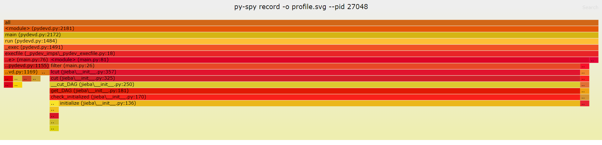
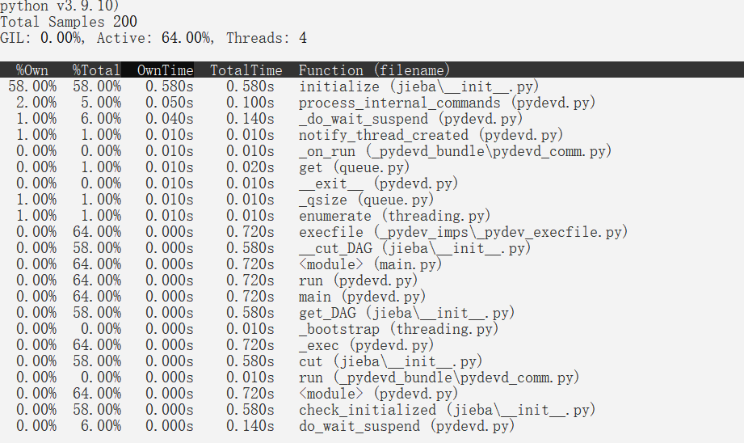

[toc]

## 1.作业基本信息

|这个作业属于哪个课程|*[网工2班 软工社区](https://bbs.csdn.net/forums/gdut-ryuezh)*|
| ---- | ---- |
|这个作业要求在哪里|*[软工第二次作业](https://bbs.csdn.net/topics/608092799)*|
|这个作业的目标|1.实现Github上提交文件<br>2.学会接口的导入及其使用<br>3.文件格式的规范化|
|Github仓库|*[仓库链接](https://github.com/NightMare-v/3120005069)*|
|其他参考文献|*[参考文献1 TF-IDF算法](https://www.ruanyifeng.com/blog/2013/03/tf-idf.html)* <br>*[参考文献2 余弦相似性算法](http://www.ruanyifeng.com/blog/2013/03/cosine_similarity.html)* |


## 2.PSP表格

| PSP2.1 | Personal Software Process Stages | 预估耗时（分钟） | 实际耗时（分钟） |
| ------ | ------ | ------ | ------ |
| Planning | 计划 | 20 | 20 |
| · Estimate | · 估计这个任务需要多少时间 | 20 | 20 |
| Development | 开发 | 490 | 515 |
| · Analysis | · 需求分析 (包括学习新技术) | 60 | 90 |
| · Design Spec | · 生成设计文档 | 60 | 50 |
| · Design Review | · 设计复审 | 20 | 30 |
| · Coding Standard | · 代码规范 (为目前的开发制定合适的规范) | 20 | 15 |
| · Design | · 具体设计 | 60 | 90 |
| · Coding | · 具体编码 | 120 | 120 |
| · Code Review | · 代码复审 | 30 | 30 |
| · Test | · 测试（自我测试，修改代码，提交修改） | 120 | 90 |
| Reporting | 报告 | 170 | 170 |
| · Test Report | · 测试报告 | 120 | 120 |
| · Size Measurement | · 计算工作量 | 20 | 30 |
| · Postmortem & Process Improvement Plan | · 事后总结, 并提出过程改进计划 | 30 | 20 |
|  | · 合计 | 680 | 705 |


## 3.计算模块接口的设计与实现过程

### 3.1 问题需求

> 题目：论文查重
>
> 描述如下：
>
> 设计一个论文查重算法，给出一个原文文件和一个在这份原文上经过了增删改的抄袭版论文的文件，在答案文件中输出其重复率。
>
> + 原文示例：今天是星期天，天气晴，今天晚上我要去看电影。
> + 抄袭版示例：今天是周天，天气晴朗，我晚上要去看电影。
> 
> 要求输入输出采用文件输入输出，规范如下：
>
> + 从命令行参数给出：论文原文的文件的绝对路径。
> + 从命令行参数给出：抄袭版论文的文件的绝对路径。
> + 从命令行参数给出：输出的答案文件的绝对路径。
> 
> 我们提供一份样例，使用方法是：orig.txt是原文，其他orig_add.txt等均为抄袭版论文。
>
> 注意：答案文件中输出的答案为浮点型，精确到小数点后两位
>

### 3.2 设计思路

对于题目要求设计论文查重的算法。

设计思路如下：

 #### 3.2.1 对文章进行词频的分割和统计

这种方法是提取关键词，从而得到一些词对于文章很重要，这里可以采用TF-IDF算法。

- "词频"（Term Frequency，缩写为TF）

- "逆文档频率"（Inverse Document Frequency，缩写为IDF）

**1. 计算词频**

计算某个词在文章中出现的次数。

**2. 对词频进行标准化**

用某个词出现的次数除以文章的总词数得到标准化词频。

**3. 计算逆文档频率**

利用公式计算出该词应该占的权重，此步骤是为了确认文章的关键词以及增大它的比重。通常可以理解为某个词比较少见，但是它在这篇文章中多次出现，那么它很可能就反映了这篇文章的特性，正是我们所需要的关键词。

**4. 计算TF-IDF值**

TF与IDF作乘积得出TF-IDF值。根据公式可以看出TF-IDF与一个词在文档中的出现次数成正比，与该词在整个语言中的出现次数成反比。然后通过排序得知关键词。

***本程序中此模块的运用***

在本程序中，使用的方法是较为简单的处理方法。

**1. 使用第三方库`jieba`**

其功能为将文章的词组进行切块与分割，形成不同的词组。

**2. 用`re.match`对词组进行格式的简单处理**

去除标点等要素可能会造成的干扰。

**3. 整合所有的词组**

将词组统计形成一个词库。

**4. 计算原文与比较的测试文章中，某个词组在其中的词频**

计算某个词组的重要性。此时计算TF-IDF值时应当使用语料库，本程序中只做简单处理，将不使用语料库计算关键词权重。

 #### 3.2.2 对数据进行比较，得出相似度

 在本程序中，采用的是余弦相似性算法。

**1. 将文章分割形成词组**

**2. 将所有词组统计形成集合**

**3. 在词组集合形成的词库中对应字计算出词频**

**4. 形成词频向量**

**5. 利用向量求得相似度**

余弦公式中，可以得知，空间中的两条线段，都是从原点（[0, 0, ...]）出发，指向不同的方向。两条线段之间形成一个夹角，如果夹角为0度，意味着方向相同、线段重合；如果夹角为90度，意味着形成直角，方向完全不相似；如果夹角为180度，意味着方向正好相反。因此，可以通过夹角的大小，来判断向量的相似程度。夹角越小，就代表越相似。

在本程序中，前三个步骤已经在之前的模块中完成，以下将从第四个模块开始：

***本程序中此模块的运用***

**4. 形成词频向量**

将词库中，两篇文章对应字的词频进行转化，形成`list`，以便接下来的向量计算。

**5. 利用向量求得相似度**

 本程序中接入了两种方法：

 - 直接使用`numpy`库中的线代计算方法进行计算余弦值
 - 使用机器学习库`sklearn`中的函数进行计算余弦相似度

 二者的结果是一致的，选用其一即可。


## 4.计算模块接口部分的性能改进

在性能分析工具中，这里使用了`py-spy`，以下为得出的结果：





从两幅图中我们可以看出，在整个程序运行中，初始化`jieba`库花费了最长的时间，其他的运行时间都相对的非常短。

更多详细内容可见细节图和附带文件`profile.svg`中。另外，也可以使用CProfile。


## 5.计算模块部分单元测试展示

在附带文件中`_testTextInit`中，准备了一些测试文件，用于单元测试，经过测试结果良好。以下是部分测试代码及其截图。

```python
    print('please enter the path of the origin work:')
    path1=input()
    print('please enter the path of the test work:')
    path2=input()
    print('please enter the path of the savedata:')
    save_path=input()
    str1 = get_file_contents(path1)
    str2 = get_file_contents(path2)
    text1 = filter(str1)
    text2 = filter(str2)
    allWords=get_all_words(text1,text2)
    list_a,list_b=get_word_vector(text1,text2,allWords)
    similarity=calculate_cos(list_a,list_b)
    # similarity=duplicate(list_a,list_b)
    print("文章相似度百分比： %.2f%%"%float(similarity*100))
    print("文章相似度： %.2f"%float(similarity))
    # 将相似度结果写入指定文件
    f = open(save_path, 'w', encoding="utf-8")
    f.write("文章相似度百分比： %.2f%%\n"%float(similarity*100))
    f.write("文章相似度： %.2f"%float(similarity))
    f.close()
```


更多详细情况可以直接进行文件测试。
